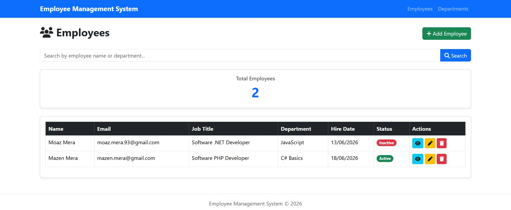
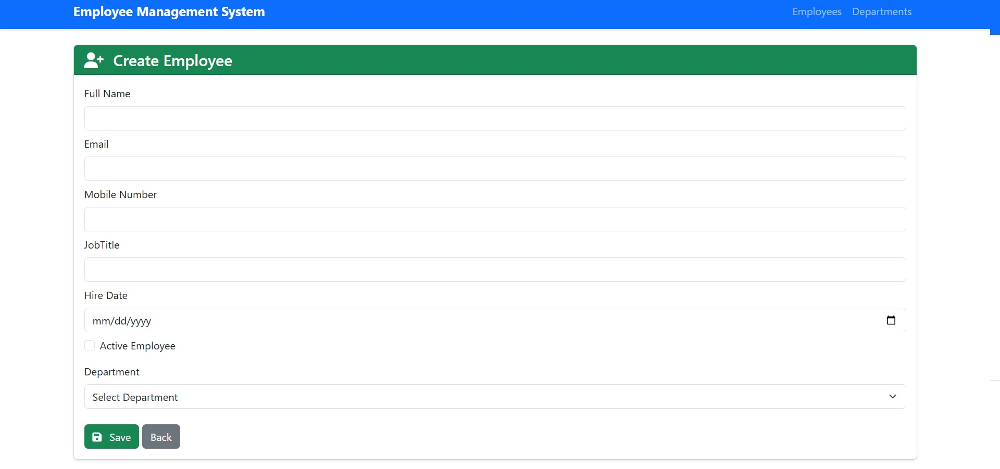
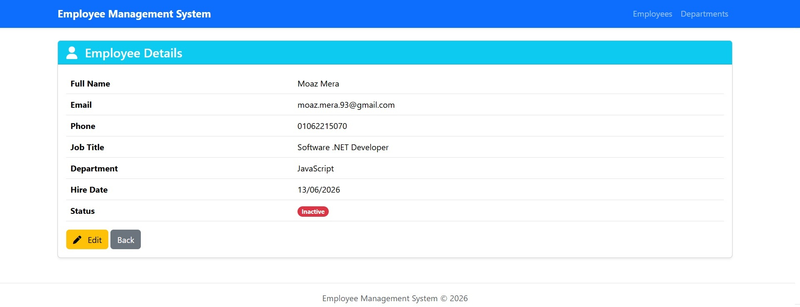
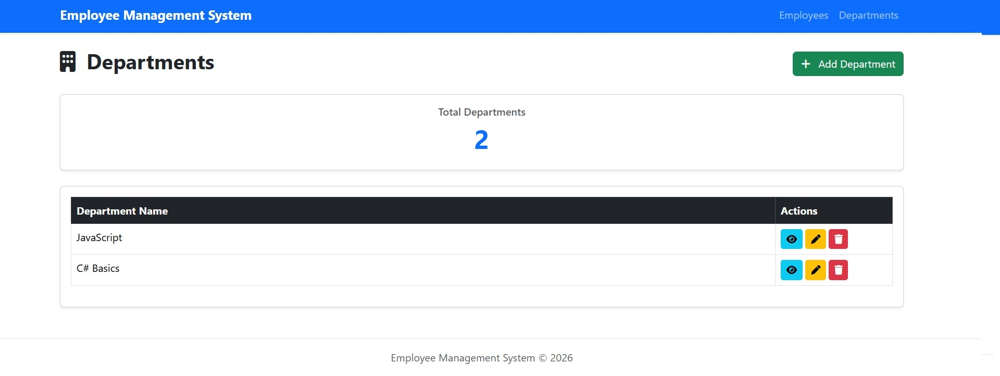

# Employee Management System

##  Description
A web application built using ASP.NET Core MVC and Entity Framework Core (Code First) to manage employees and departments.

The system supports full CRUD operations with clean UI and validation.

---

##  Features

### Employees
- Create, edit, delete employees
- View employee details
- Search by name or department
- Show active/inactive status

### Departments
- Create, edit, delete departments
- View department details
- Prevent deletion if department has employees

---

##  Technologies
- ASP.NET Core MVC
- Entity Framework Core
- SQL Server
- Repository Pattern
- Service Layer
- Bootstrap 5

---

##  How to Run

1. Update connection string in `appsettings.json`
2. Run migrations
3. Run project using Visual Studio

---

##  Screenshots

### Employees

### Departments

---

##  Notes
- Make sure SQL Server is running
- Update connection string before running project

---

## Author
Moaz Mera